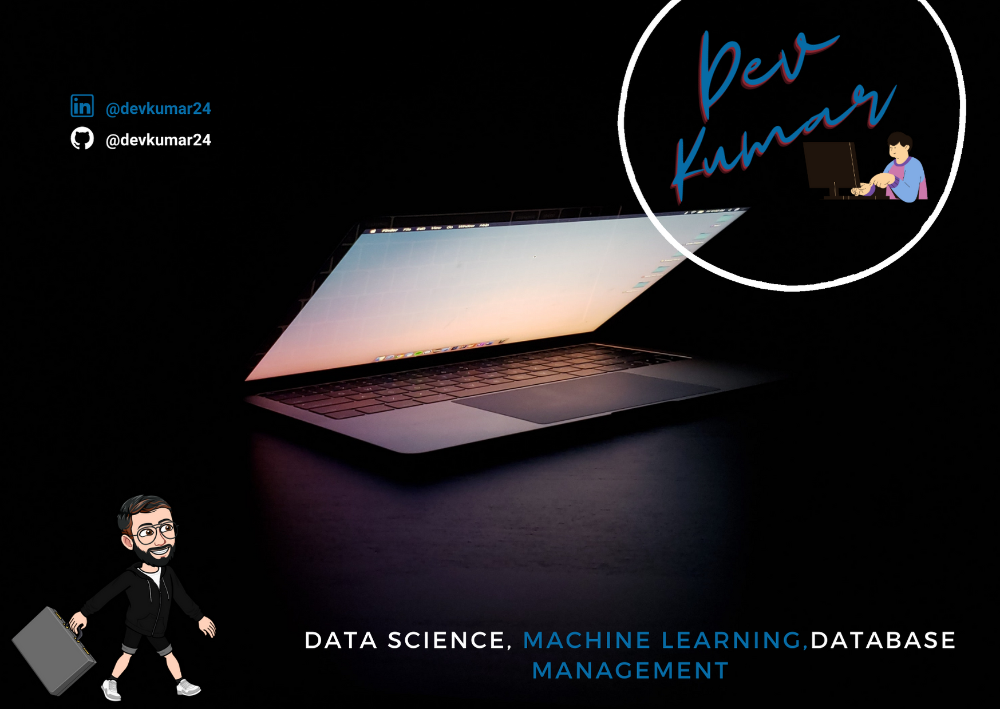

## Hi,I'm Dev 👋 :computer:

##### I'm a Data Scientist, who is passionate about creating a solution of computer vision tasks, and interested only in datasets, creating technology to elevate people and building more and more communities, and I love to explore data. Technology I love to work in TensorFlow, OpenCV, NumPy, SQL. I have solved around 25 datasets from Kaggle, and now I am started contributing to Kaggle Competition. Apart from the field of Data Science, I'm interested in Front-end Web Development(HTML, CSS, JavaScript). Not only does technology inspire me, but I am a lover of nature :evergreen_tree: and space :rocket: :milky_way: . I used to read about space technologies and love to travel places where we won't require electronic gadgets. 

## Find me around the Web: :earth_americas:

 * Sharing Updates on [LinkedIn](https://www.linkedin.com/in/devkumar24/) :black_nib: :briefcase:
 * Competiting With Myself on [Kaggle](https://www.kaggle.com/devkumar247) :chart_with_upwards_trend:
 * Chilling on Social Media [Instagram](https://www.instagram.com/aryan_mehtaa_/) :ghost:
